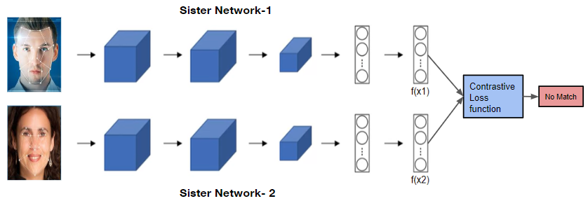

## SiamNet: Lightweight Face Recognition using Siamese Network

### Overview
SiamNet is a specialized deep learning architecture designed to address the challenge of face recognition. It leverages a Siamese network, which is particularly effective for tasks involving image comparison. Unlike traditional neural networks that classify images directly, a Siamese network focuses on learning the similarity between pairs of images. This is crucial for face recognition, where the goal is to determine whether two faces belong to the same person.

How Siamese Networks Work
A Siamese network consists of two identical subnetworks that share the same architecture and weights. These subnetworks process two input images independently to produce two feature vectors. These vectors are then compared using a distance metric, such as Euclidean distance, to determine the similarity between the images. The training process involves minimizing a contrastive loss function, which ensures that the distance between similar images is minimized and the distance between dissimilar images is maximized.

#### Application in Face Recognition
In the context of face recognition, SiamNet operates by:

#### Preprocessing: Detecting and cropping faces from images.

Feature Extraction: Using convolutional layers to extract features from the face images.
Similarity Measurement: Calculating the distance between the feature vectors of two faces.
Decision Making: Determining whether the faces belong to the same person based on the calculated distance.

Key Components
Input Images: Two images are fed into the network, one in each branch.
Convolutional Layers: These layers extract meaningful features from the images, transforming them into lower-dimensional feature maps.
Fully Connected Layers: These layers further process the feature maps to produce compact feature vectors that represent the images in a way that captures their essence for comparison.
Distance Calculation: The feature vectors are compared using a distance metric to determine how similar or dissimilar the images are.
Loss Function: The contrastive loss function drives the training process by penalizing the network when similar images are too far apart or dissimilar images are too close in the feature space.
Training and Evaluation
During training, the network is fed pairs of images that are either of the same person (positive pairs) or different persons (negative pairs). The network learns to adjust its weights such that the distance between the feature vectors of positive pairs is minimized, while the distance for negative pairs is maximized. This process allows the network to generalize and effectively compare new, unseen image pairs during evaluation.

The system's performance can be visualized through accuracy metrics and the analysis of the distance distributions between positive and negative pairs. This helps in understanding how well the network distinguishes between similar and dissimilar faces.

### Features
 1. Face Detection and Preprocessing: Uses OpenCV's Haar cascades for detecting and preprocessing faces in images.
 2. Robust Training and Evaluation: Includes scripts for creating image pairs, training the network, and evaluating its performance.
    
### Visualization Tools: Provides functions to visualize the model’s performance, including plotting the distribution of distances between positive and negative pairs.

#### Repository Structure
new_lfw/: Contains the LFW dataset.
scripts/:
dataset.py: Manages dataset loading and preprocessing.
load_dataset.py: Handles the LFW dataset loading.
model.py: Defines the Siamese network architecture.
pairs.py: Generates image pairs for training/testing.
preprocess.py: Contains face detection and preprocessing logic.
train.py: Script to train the Siamese network.
visualize.py: Functions to visualize training results and model performance.
